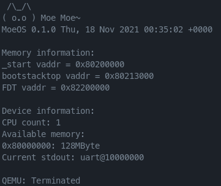

# MoeOS  ⁄(⁄ ⁄•⁄ω⁄•⁄ ⁄)⁄

 ٩(^ᴗ^)۶欢迎参观MoeOS的仓库，MoeOS是一个小巧可爱（并不）的操作系统，目前全力支持RISC-V中。

 (*≧▽≦)因为还只是一个玩具操作系统，就别要求她能做太多事情啦！现在功能还不完善，会慢慢加的，会慢慢从虚拟机搬家到物理机上面的！

## 最新截图

> (〃∀〃)要拍照么

## 感谢

> (　ﾟ∀ﾟ) ﾉ♡没有他们就没有MoeOS

- [rCore](https://github.com/rcore-os/rCore)
- [The Adventures of OS](https://osblog.stephenmarz.com/index.html)
