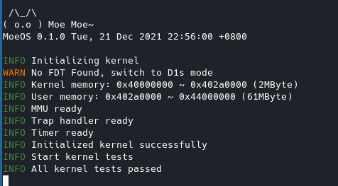

# MoeOS  ⁄(⁄ ⁄•⁄ω⁄•⁄ ⁄)⁄

 ٩(^ᴗ^)۶欢迎参观MoeOS的仓库，MoeOS是一个小巧可爱（并不）的操作系统，目前全力支持RISC-V中。

 (*≧▽≦)因为还只是一个玩具操作系统，就别要求她能做太多事情啦！现在功能还不完善，会慢慢加的！

## 编译

> 呐，你想给我找个家么？

目前MoeOS支持在QEMU和全志D1s芯片（人家比较喜欢[Nezha MQ](https://mangopi.org.cn/mangopi_mq)嘛）上运行，需要安装下面的工具：

- Rust Toolchain（没工具链咋编译呀）
- QEMU（记得选RISC-V支持哦）
- [xfel](https://github.com/xboot/xfel)（用于把MoeOS搬到板子的内存上啦）
- make（既然有make为什么没有remake呢）

在QEMU上执行：

```
make qemu
```

在D1s上执行：

```
make d1s
```

切换平台需要先执行一次`make clean`。

## 最新截图

> (〃∀〃)要拍照么



## 感谢

> (　ﾟ∀ﾟ) ﾉ♡没有他们就没有MoeOS

- [rCore](https://github.com/rcore-os/rCore)
- [The Adventures of OS](https://osblog.stephenmarz.com/index.html)
